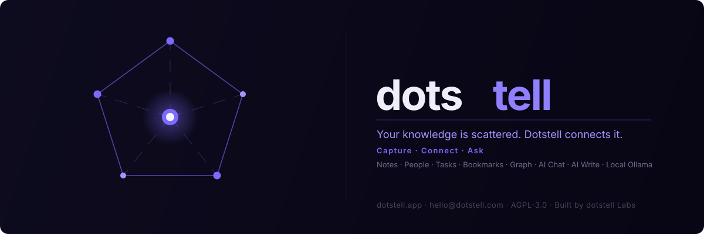

<div align="center">

<br/>



<br/>
<br/>

### Your knowledge is scattered. Dotstell connects it.

**Notes · People · Tasks · Bookmarks · Wikilinks — all linked in one living knowledge graph**

<br/>

[](LICENSE)
[](https://nextjs.org)
[](https://typescriptlang.org)
[](https://tauri.app)
[](https://supabase.com)
[](https://tailwindcss.com)
[](CONTRIBUTING.md)

<br/>

[Website](https://www.dotstell.com) · [Live App](https://dotstell.app) · [Report a bug](https://github.com/dotstell/dotstell/issues) · [Request a feature](https://github.com/dotstell/dotstell/issues) · [Contact](mailto:hello@dotstell.com)

</div>

---

## What is Dotstell?

Dotstell is an open source personal knowledge graph — a single place to write notes, track people, manage tasks, save bookmarks, and connect all of them together through a visual graph.

Most productivity tools are built around **capture**. Dotstell is built around **connection**.

The question it answers that other tools don't:

> *"What do I know about this person, this project, this decision — right now, in full context?"*

---

## Features

| | Feature | Description |
|---|---|---|
| 📑 | **Rich Text Notes** | Write in rich text with slash commands, tables, code blocks and checklists |
| ⬡ | **Wikilinks & Backlinks** | Type `[[` in any note to link it to another — backlinks update automatically |
| 📓 | **Notebooks** | Organise notes into named collections with colour-coded sidebar grouping |
| 👥 | **People & 1-on-1s** | Track contacts, attach notes, tasks and context directly to people — supports `@mention` in notes |
| 🔖 | **Smart Bookmarks** | Save any URL — title, description and favicon fetched automatically; bulk import from Chrome, Firefox or Safari |
| ✅ | **Tasks & Priorities** | Kanban board + list view with priorities, due dates and overdue alerts |
| 🌐 | **Knowledge Graph** | Visual map of everything — wikilinks and manual connections appear as live edges |
| 🔍 | **Universal Search** | Ctrl+K command palette across all notes, people, tasks and bookmarks |
| 🔗 | **Manual Linking** | Connect any entity to any other — note → person, bookmark → task, etc. |
| 🏠 | **Dashboard** | Unified home screen: overdue alerts, task progress, recent notes and bookmarks |

---

## Screenshots

Live previews of the app are available on [dotstell.com](https://www.dotstell.com) — the landing page includes an interactive knowledge graph, dashboard mockup, and feature walkthroughs.

Try the live app at [dotstell.app](https://dotstell.app) or [download the desktop build](#getting-started) for Windows, macOS and Linux.

---

## Getting Started

### Prerequisites

- Node.js 18+
- pnpm — `npm install -g pnpm`
  > We use pnpm instead of npm/yarn because it is significantly faster (hard-linked global store, no re-downloading the same package twice), produces a deterministic `pnpm-lock.yaml`, and is required by the Tauri CLI toolchain used for the desktop build. The lockfile is committed — always use `pnpm install`, not `npm install`, to keep the lockfile consistent.
- A free [Supabase](https://supabase.com) account

### 1. Clone

```bash
git clone https://github.com/dotstell/dotstell.git
cd dotstell
```

### 2. Install dependencies

```bash
pnpm install
```

### 3. Set up Supabase

1. Create a new project at [supabase.com](https://supabase.com)
2. Go to **SQL Editor** and run `supabase/schema.sql` to create all tables, policies, and triggers.

   For an existing database, apply migrations in order:

```
supabase/migrations/
├── add_notebooks_table.sql
├── add_notes_soft_delete.sql
├── 002_bookmarks_enhancements.sql
├── 003_bookmark_visits.sql
├── 004_notes_parent.sql
├── 005_notes_sort_pin.sql
├── 006_notes_color.sql
└── 007_notebooks_constraints.sql
```

3. Copy your project URL and anon key from **Settings → API**

### 4. Configure environment

```bash
cp .env.local.example .env.local
```

Edit `.env.local`:

```env
NEXT_PUBLIC_SUPABASE_URL=https://your-project.supabase.co
NEXT_PUBLIC_SUPABASE_ANON_KEY=your-anon-key
```

> **Behind a corporate SSL proxy?** Add `NODE_TLS_REJECT_UNAUTHORIZED=0` to your `.env.local`. Do **not** set this in production.

### 5. Run

```bash
pnpm dev
```

Open [http://localhost:3000](http://localhost:3000), create an account and start connecting your knowledge.

---

## Tech Stack

| Layer | Technology |
|---|---|
| Framework | Next.js 16 (App Router, React 19) |
| Language | TypeScript 5 · Rust (desktop shell) |
| Styling | Tailwind CSS v4 |
| Database | Supabase (PostgreSQL 15 + Row Level Security) |
| Auth | Supabase Auth (JWT) |
| Rich Text Editor | Tiptap v3 |
| Graph Visualisation | React Flow v11 |
| Desktop | Tauri v2 (native WebView wrapper, ~10 MB installer) |
| Icons | Lucide React |

See [docs/ARCHITECTURE.md](docs/ARCHITECTURE.md) for a full breakdown of the system design, data model, security model, and key design decisions.

---

## Project Structure

```
src/
├── app/
│   ├── api/                          # Next.js API routes (server-side)
│   │   ├── notes/                    # Notes list + create
│   │   ├── notes/[id]/               # Note CRUD (soft delete)
│   │   ├── notes/[id]/backlinks/     # Backlink lookup for a note
│   │   ├── notes/[id]/wikilinks/     # Wikilink edge sync on save
│   │   ├── notes/[id]/unlinked-mentions/ # Unlinked [[title]] detection
│   │   ├── notes/[id]/restore/       # Restore note from trash
│   │   ├── notes/[id]/permanent/     # Permanent delete (bypass soft)
│   │   ├── notes/trash/              # List trashed notes
│   │   ├── notebooks/                # Notebooks list + create
│   │   ├── notebooks/[id]/           # Notebook rename / delete
│   │   ├── people/                   # People list + create
│   │   ├── people/[id]/              # Person CRUD
│   │   ├── bookmarks/                # Bookmarks list + create
│   │   ├── bookmarks/[id]/           # Bookmark patch / delete
│   │   ├── bookmarks/bulk-import/    # Netscape HTML file parser
│   │   ├── bookmarks/bulk-delete/    # Delete multiple bookmarks
│   │   ├── bookmarks/preview-import/ # Parse without saving (preview)
│   │   ├── bookmarks/manage-tags/    # Rename / delete a tag globally
│   │   ├── bookmarks/fetch-meta/     # SSRF-protected URL metadata fetch
│   │   ├── bookmarks/visit/          # Record visit + update last_visited_at
│   │   ├── tasks/                    # Tasks list + create
│   │   ├── tasks/[id]/               # Task CRUD
│   │   ├── links/                    # Knowledge links (manual + wikilink edges)
│   │   ├── wikilinks/                # Wikilink resolution (title → id lookup)
│   │   ├── graph/                    # Graph data (all nodes + edges combined)
│   │   └── search/                   # Full-text search across all entity types
│   ├── auth/                         # Login, register, OAuth callback
│   ├── dashboard/                    # Home: overdue tasks, recent notes
│   ├── notes/                        # Notes list
│   ├── notes/[id]/                   # Note editor (full page)
│   ├── people/                       # People list
│   ├── people/[id]/                  # Person detail + attached notes/tasks
│   ├── bookmarks/                    # Bookmarks + collections
│   ├── tasks/                        # Kanban board + list view
│   ├── graph/                        # Interactive knowledge graph
│   ├── tags/                         # Tag browser across all entity types
│   ├── search/                       # Global search results
│   └── help/                         # Help & keyboard shortcuts
├── components/
│   ├── editor/                       # Tiptap editor + WikiLinkExtension node
│   ├── layout/                       # Sidebar, AppLayout, PageHeader
│   ├── command/                      # Ctrl+K command palette
│   ├── links/                        # LinkPanel (manual entity-to-entity linking)
│   ├── graph/                        # Graph canvas, node/edge renderers
│   ├── notes/                        # NoteCard, NotesSidePane, BacklinksPanel
│   ├── bookmarks/                    # BookmarkCard, BookmarkImport, TagFilter
│   ├── people/                       # PersonCard, PersonDetail
│   ├── tasks/                        # TaskCard, KanbanBoard, TaskList
│   ├── onboarding/                   # First-run onboarding flow
│   ├── brand/                        # Logo and brand assets
│   └── ui/                           # Design system: buttons, dialogs, inputs
├── hooks/                            # useNotebooks, useMention, useTheme, etc.
├── store/                            # Zustand global stores
├── lib/
│   ├── supabase/                     # Browser + server Supabase clients
│   ├── tiptap/                       # WikiLinkExtension (custom ProseMirror node)
│   └── ratelimit.ts                  # In-memory rate limiter
└── types/                            # Shared TypeScript types
src-tauri/
├── src/lib.rs                        # Tauri v2 desktop shell (Rust)
└── tauri.conf.json                   # App metadata, permissions, updater config
supabase/
├── schema.sql                        # Full schema: tables, RLS, indexes, triggers
└── migrations/                       # Incremental SQL migrations (002 → 007)
```

---

## Roadmap

| Feature | Status |
|---|---|
| Notes, People, Tasks, Bookmarks | ✅ Live |
| Wikilinks + Backlinks | ✅ Live |
| Knowledge Graph | ✅ Live |
| Desktop app (Windows, macOS + Linux) | ✅ Live |
| AI layer (auto-tagging, semantic search) | 🔜 Soon |
| Docs (per-project documentation) | 🔜 Soon |
| Browser extension | 🔜 Planned |
| Integrations (Slack, Teams, etc.) | 🔜 Planned |
| Mobile app | 🔜 Planned |

---

## Contributing

Contributions are welcome and genuinely appreciated.

- **Bug reports & feature requests** — open an [issue](https://github.com/dotstell/dotstell/issues)
- **Code contributions** — please open an issue first for anything significant so we can align on approach
- **Docs, design, tests** — always welcome without prior discussion

See [CONTRIBUTING.md](CONTRIBUTING.md) for full guidelines.

---

## Self-Hosting

Dotstell is designed to be self-hostable. You need:

- A Node.js server (or Vercel / any Next.js host)
- A Supabase project (or self-hosted Supabase)

Full self-hosting guide coming soon. In the meantime the Getting Started steps above cover a local setup.

---

## License

[GNU Affero General Public License v3.0](LICENSE) — AGPL-3.0

This means you can use, modify and distribute Dotstell freely, including self-hosting it. If you run a modified version as a network service, you must make the modified source available to users of that service.

© 2026 Dotstell
